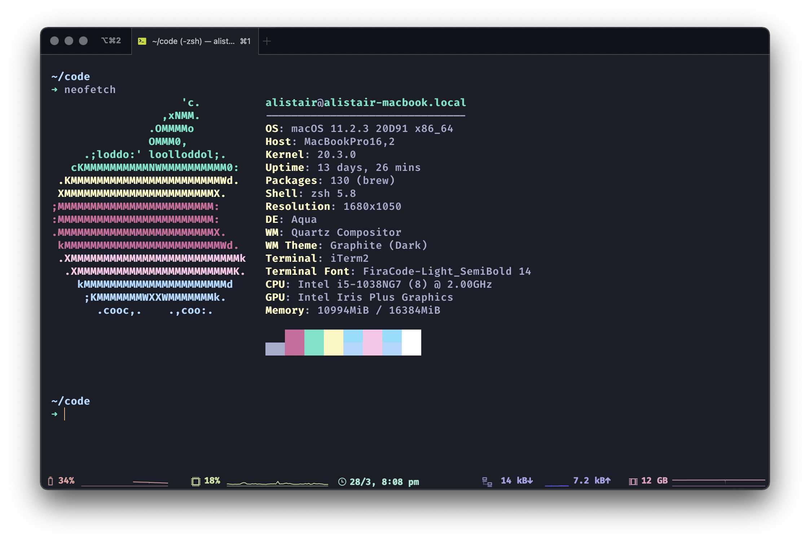
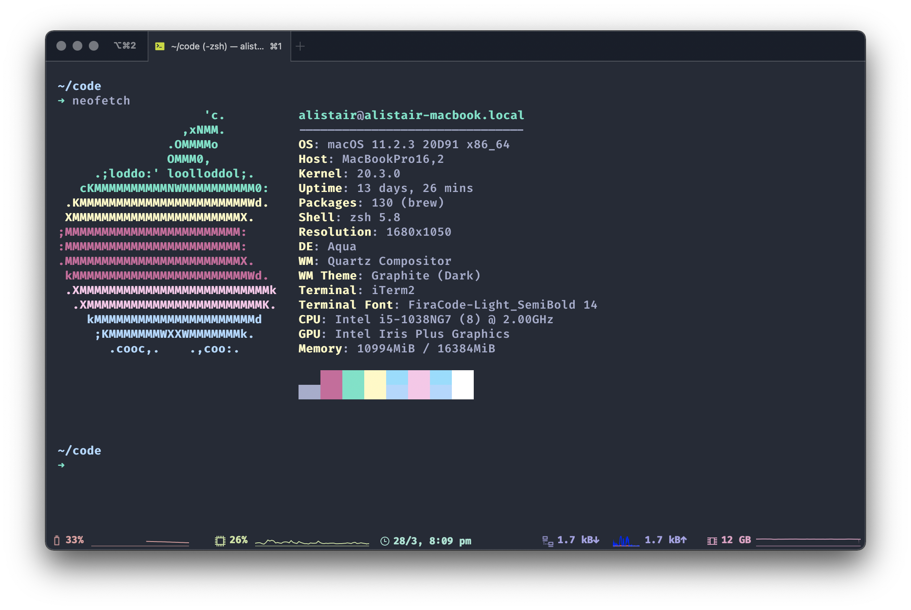
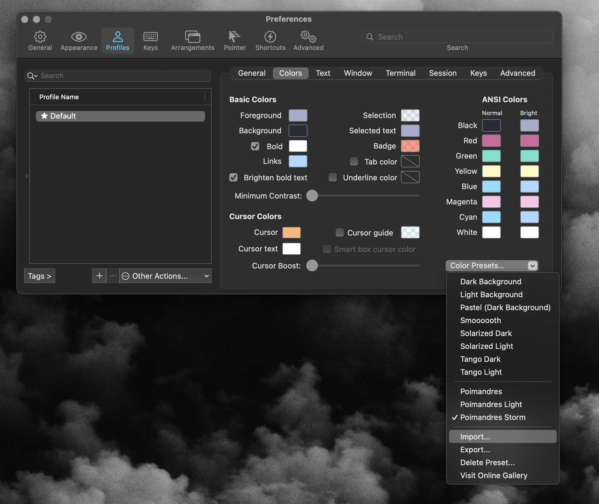

# poimandres-iterm

A collection of iTerm color profiles inspired by the Poimandres VSCode themes

## Screenshots

<h3 style="text-align: center;">Normal</h3>

<h3 style="text-align: center;">Storm</h3>

<h3 style="text-align: center;">Light</h3>

## Installation

1. Download the theme you like the most from [./themes](./themes)
2. Choose "Import" under your profile's colors and select the theme you downloaded 
